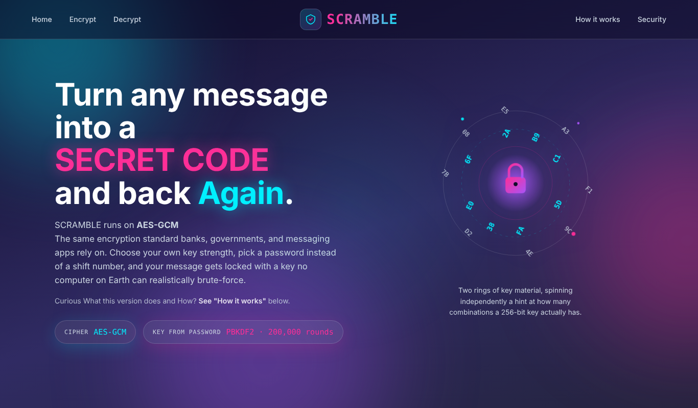
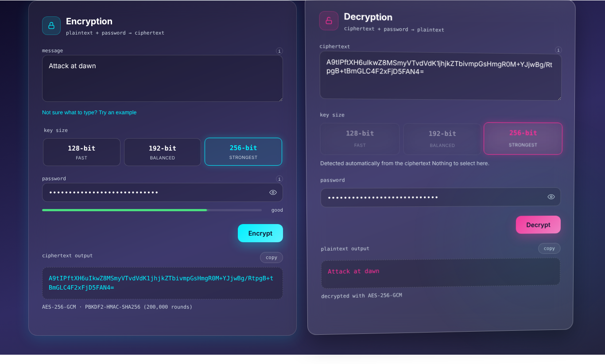
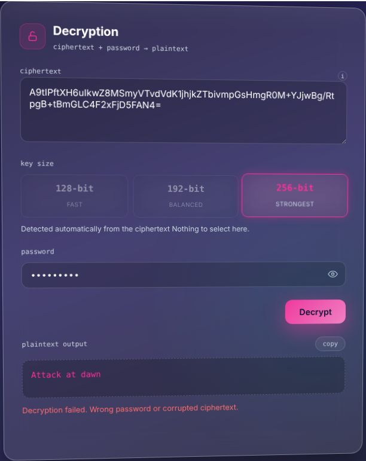
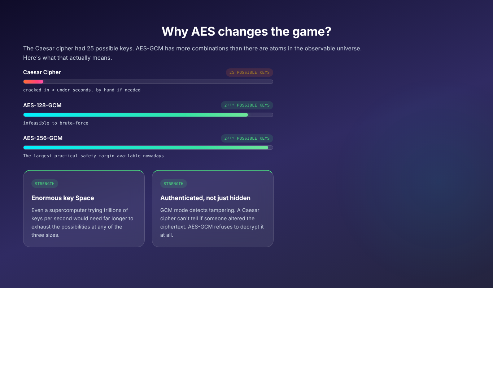

# SCRAMBLE: AES Encryption Engine

**DecodeLabs Cyber Security Internship | Project 2: Encryption and Decryption**

  

A full-stack encryption tool. A Flask backend does real AES-128, AES-192 or AES-256 GCM encryption with password-based key derivation, and a single-file animated frontend explains why it is secure while you use it. The project started as a Caesar cipher and was upgraded to industry-standard cryptography.



## Table of contents

1. [Why this project exists](#why-this-project-exists)
2. [Screenshots](#screenshots)
3. [Project structure](#project-structure)
4. [Setup and running](#setup-and-running)
5. [How the cryptography works](#how-the-cryptography-works)
6. [Ciphertext format](#ciphertext-format)
7. [API reference](#api-reference)
8. [Test results](#test-results)
9. [Security notes and limitations](#security-notes-and-limitations)
10. [Troubleshooting](#troubleshooting)
11. [Ideas for extending it](#ideas-for-extending-it)

## Why this project exists

The brief asked for a basic encryption and decryption tool, originally a Caesar cipher (`E(x) = (x + n) mod 26`). A Caesar cipher teaches the mechanics (input, algorithm and key, output) but is not secure: it has only 25 keys and a computer tries them all instantly. SCRAMBLE keeps the same idea and replaces the cipher with **AES**, the algorithm used by browsers, banks, messaging apps and disk encryption.

| | Caesar cipher (original) | SCRAMBLE (this version) |
|---|---|---|
| Cipher | Shift substitution | AES in GCM mode |
| Key | A number from 1 to 25 | A password stretched into a 128, 192 or 256-bit key |
| Key space | 25 keys | 2^128, 2^192 or 2^256 keys |
| Tamper detection | None | Yes, through the GCM authentication tag |
| Practical security | None | Secure with a strong password |

## Screenshots



| Wrong password | Security section |
|---|---|
|  |  |

## Project structure

```
scramble-aes/
├── app.py          Flask backend: all cryptography lives here
├── index.html      Frontend: HTML, CSS and JavaScript in one file
├── screenshots/    Images used in this README
└── README.md
```

## Setup and running

### 1. Backend

```bash
pip install flask flask-cors cryptography
python app.py
```

The API starts on http://127.0.0.1:5000. There is no route at `/` on purpose; check it is alive at:

```
http://127.0.0.1:5000/api/health
{"status": "online", "service": "SCRAMBLE API (AES edition)"}
```

### 2. Frontend

Open `index.html` in a browser, or serve it:

```bash
python -m http.server 5500
# then open http://127.0.0.1:5500
```

The frontend calls the API at `http://127.0.0.1:5000` (the `API_BASE` constant near the top of the script). Change that one constant if the backend runs elsewhere.

**Requirements:** Python 3.8+, `flask`, `flask-cors`, `cryptography`, and any modern browser.

## How the cryptography works

```
Plaintext + Password
        |
        v
  PBKDF2-HMAC-SHA256     (200,000 iterations, random salt)
        |                 -> 16 / 24 / 32 byte key
        v
     AES-GCM             (random 12-byte nonce)
        |                 -> encrypts AND authenticates
        v
Ciphertext + 16-byte tag -> base64 -> shown to the user
```

**Why PBKDF2.** AES needs a key of exactly 16, 24 or 32 random-looking bytes; a password is not that. PBKDF2 runs the password through SHA-256 200,000 times with a random salt. The output always has the right size, and an attacker has to repeat all 200,000 rounds for every guess.

**Why GCM.** Plain AES only scrambles one 16-byte block. GCM lets AES handle messages of any length and adds a 16-byte authentication tag. If the password is wrong, or even one byte of the ciphertext changed, the tag check fails and decryption is refused instead of returning garbage.

| Key size | Key length | Rounds |
|---|---|---|
| AES-128 | 16 bytes | 10 |
| AES-192 | 24 bytes | 12 |
| AES-256 | 32 bytes | 14 |

## Ciphertext format

The ciphertext is one base64 string made of four parts:

| Part | Size | Purpose |
|---|---|---|
| Marker | 1 byte | Records the key size so Decrypt can detect it automatically |
| Salt | 16 bytes | Random per encryption, fed into PBKDF2 |
| Nonce | 12 bytes | Random per encryption, required by AES-GCM |
| Ciphertext + tag | variable | The encrypted data with the 16-byte authentication tag |

Encrypting the same message with the same password twice gives a different ciphertext each time. That is expected and shows the randomisation works.

## API reference

Base URL: `http://127.0.0.1:5000`

### `POST /api/encrypt`

```json
{ "text": "Attack at dawn", "password": "correct horse battery staple", "key_size": 256 }
```

`key_size` must be 128, 192 or 256. Response:

```json
{
  "output": "base64-encoded-blob...",
  "algorithm": "AES-256-GCM",
  "key_size": 256,
  "key_derivation": "PBKDF2-HMAC-SHA256",
  "iterations": 200000
}
```

### `POST /api/decrypt`

```json
{ "text": "base64-encoded-blob...", "password": "correct horse battery staple" }
```

No `key_size` is needed; it is read from the marker byte. Response:

```json
{ "output": "Attack at dawn", "key_size": 256, "algorithm": "AES-256-GCM" }
```

Wrong password, tampered ciphertext and malformed base64 all return the same message on purpose, so an attacker learns nothing about which one failed:

```json
{ "error": "Decryption failed. Wrong password or corrupted ciphertext." }
```

### `GET /api/health`

Returns `{"status": "online", "service": "SCRAMBLE API (AES edition)"}`.

## Test results

"Attack at dawn" was encrypted with the password "correct horse battery staple" at each key size through the running API.

| Key size | Round trip | Same input twice | Wrong password | One byte changed |
|---|---|---|---|---|
| AES-128-GCM | Original text recovered | Different ciphertext | Rejected | Rejected |
| AES-192-GCM | Original text recovered | Different ciphertext | Rejected | Rejected |
| AES-256-GCM | Original text recovered | Different ciphertext | Rejected | Rejected |

## Security notes and limitations

This project is for learning, not for protecting anything that matters.

- **The password is the weakest link.** `password123` under AES-256 is still easy to guess. PBKDF2 slows guessing down; it does not make a bad password good.
- **No password recovery, by design.** A lost password means the data cannot be recovered.
- **Flask debug server.** The backend runs with `debug=True`, which is for local use only.
- **Open CORS.** `CORS(app)` allows any origin. Restrict it before deploying anywhere public.
- **Vague errors are intentional.** They are a security practice, not a missing feature.

## Troubleshooting

| Problem | Fix |
|---|---|
| `http://127.0.0.1:5000/` shows 404 | Expected. Use `/api/health` to check the server |
| Decrypt always fails | The password must match exactly (case-sensitive), and the ciphertext must be copied completely with no added whitespace |
| `ModuleNotFoundError: flask_cors` | Run `pip install flask flask-cors cryptography` |
| Animations look static | Check your OS "Reduce motion" setting; some animations are disabled by it |

## Ideas for extending it

- Argon2id instead of PBKDF2 for better resistance to GPU cracking.
- File encryption, not just text.
- Rate limiting on `/api/decrypt`.
- A side-by-side brute-force demo of Caesar versus AES.
- Export the ciphertext as a `.txt` file or QR code.

## Credits

Built as Project 2 of the DecodeLabs Cyber Security internship, 2026.
Author: S Fatima Manzoor
