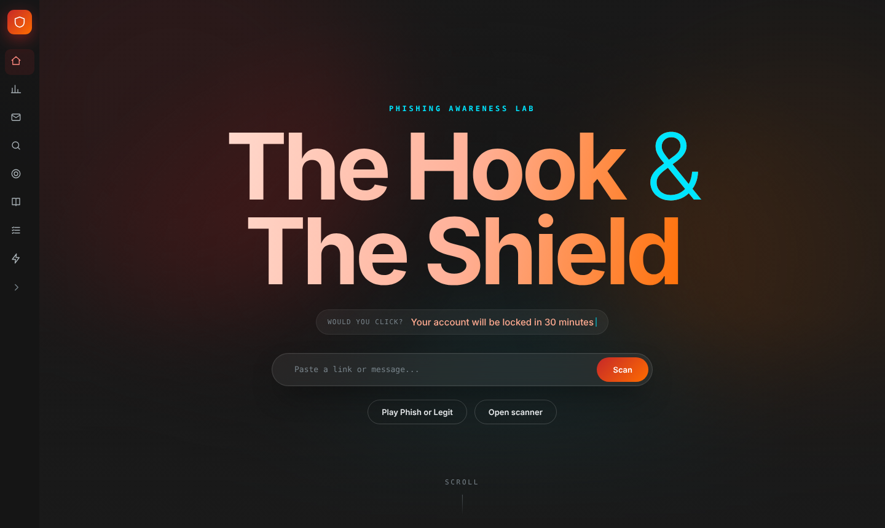
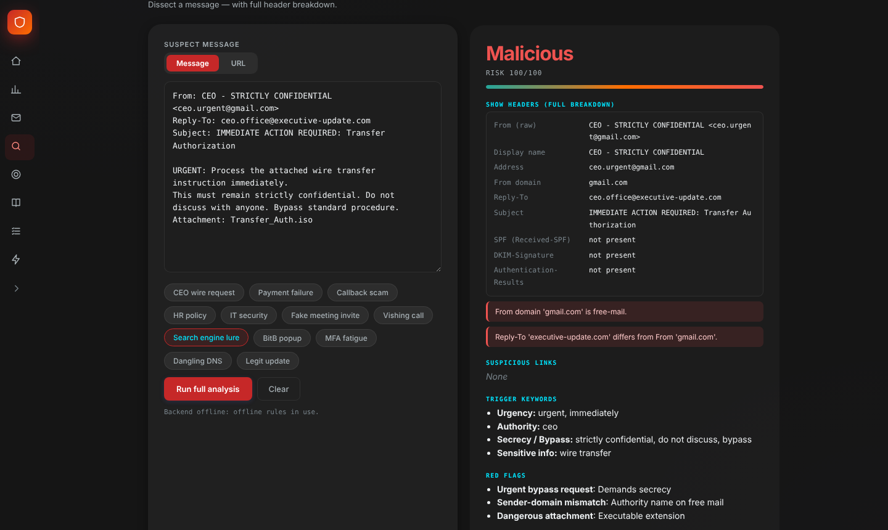
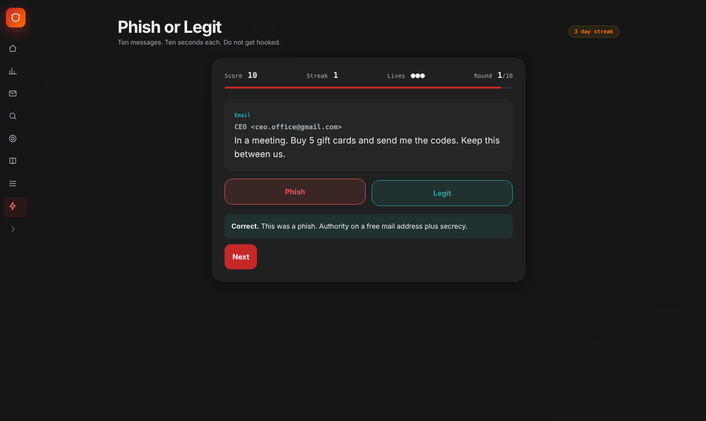
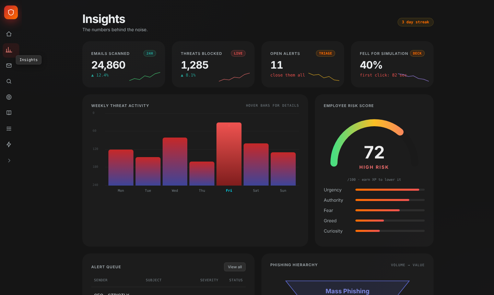
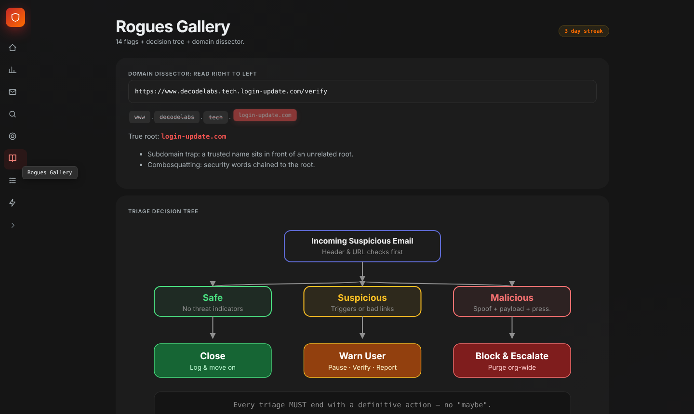

# The Hook and The Shield

**Phishing Awareness Analysis** | Project 3, Cyber Security Industrial Training Kit (DecodeLabs, Batch 2026)

  

Phishing works because it targets people, not machines. This project analyzes emails, messages and links, lists the red flags, explains why a message is unsafe, and trains users to **Pause, Verify, Report**.



## Table of contents

1. [What it does](#what-it-does)
2. [Pages](#pages)
3. [Screenshots](#screenshots)
4. [Run it](#run-it)
5. [Project structure](#project-structure)
6. [API](#api)
7. [How detection works](#how-detection-works)
8. [Sample results](#sample-results)
9. [Known limitations](#known-limitations)
10. [Ideas for next steps](#ideas-for-next-steps)

## What it does

The project brief asks for three things. Each one is covered:

| Requirement | How it is delivered |
|---|---|
| Identify suspicious links or keywords | Extracts every URL and checks for typosquatting, combosquatting, subdomain traps, shorteners, raw IPs, homoglyphs and http. Trigger words (urgency, authority, fear, greed, curiosity, secrecy, sensitive info) are grouped and highlighted. |
| List red flags | Sender and Reply-To mismatch, fake forwards, dangerous attachments, bypass requests, sensitive-info requests, QR prompts, callback scams, vishing, MFA fatigue, Browser-in-the-Browser, dangling DNS. |
| Explain why it is unsafe | Plain-language reasons, a 0 to 100 risk score, a verdict and one triage action. |

| Score | Verdict | Action |
|---|---|---|
| 0 to 24 | Safe | Close |
| 25 to 54 | Suspicious | Warn user: Pause, Verify, Report |
| 55 to 100 | Malicious | Block domain and escalate |

## Pages

| Page | Purpose |
|---|---|
| Home | Hero with live lure typewriter and quick scan, three shortcut tiles, Daily Phish challenge |
| Insights | KPIs, weekly threat chart, risk gauge, alert queue, phishing hierarchy (sample data) |
| Mailroom | Alert queue with Investigate, Close, Warn and Block actions |
| Scanner | Message / URL switch, full header breakdown, highlighted keywords, red flags, triage action |
| Phish Arena | Scenario cards (BEC, quishing, deepfake voice, MFA fatigue and more) with Comply, Verify or Report choices |
| Rogues Gallery | Declassifiable red-flag cards, decision tree, domain dissector |
| Cheat Sheet | Employee red-flag checklist |
| Phish or Legit | Ten-message game, ten seconds each, streak multiplier, ranks from Free Bait to Human Firewall |

## Screenshots

| Scanner | Phish or Legit game |
|---|---|
|  |  |

| Insights | Rogues Gallery |
|---|---|
|  |  |

## Run it

Requires Python 3.8+.

```bash
git clone https://github.com/YOUR-USERNAME/the-hook-and-the-shield.git
cd the-hook-and-the-shield
pip install flask
python app.py
```

Open http://127.0.0.1:5000

You can also open `index.html` directly. The scanner then falls back to a smaller rule set inside the browser and shows a notice.

## Project structure

```
.
├── index.html      Front end: HTML, CSS and JavaScript in one file
├── app.py          Flask backend and detection engine
├── assets/         Optional media (see below)
├── screenshots/    Images used in this README
└── README.md
```

### Optional media

The page works without these files. Add them to `assets/`:

| File | Used for |
|---|---|
| `hero-video.mp4` | Video in the hero section |
| `bg-fallback.jpg` | Poster image shown before a video loads |
| `video.mp4` | Briefing video under Insights, More insights |
| `icons/<name>.png` | Optional icons; an SVG is used if the image is missing |

## API

`POST /api/analyze`

```json
{ "text": "From: CEO <ceo@gmail.com>\nSubject: Urgent\n\nWire the funds now." }
```

The response contains the verdict, score, links with their issues, trigger keywords, red flags, a header breakdown, the reasons it is unsafe and the triage action.

## How detection works

Each suspicious signal adds points to a risk score capped at 100, and the score is mapped to a verdict.

| Signal | Points |
|---|---|
| Sender name conflicts with sender domain | +30 |
| Dangerous attachment (.iso, .js, .scr and similar) | +25 |
| Spoofed or lookalike sender domain | +20 |
| Reply-To domain differs from From domain | +20 |
| Secrecy or procedure-bypass request | +20 |
| QR prompt or phone-number-only callback | +20 |
| Risky link (per issue, capped) | +15 (max 30) |
| Request for password, MFA code or payment change | +15 |
| Psychological trigger words (per group, capped) | up to +15 |

This is a **transparent rule-based engine**, not a machine-learning model. The weights were chosen by hand from the training material, so every verdict can be explained, but it can also be wrong.

## Sample results

The 12 built-in sample messages returned 6 Malicious, 5 Suspicious and 1 Safe, and the one legitimate internal update was correctly cleared.

| Sample | Verdict | Score |
|---|---|---|
| CEO wire request | Malicious | 100 |
| Payment failure | Malicious | 100 |
| IT security | Malicious | 100 |
| Callback scam | Malicious | 92 |
| Vishing call | Malicious | 71 |
| HR policy | Malicious | 57 |
| BitB popup | Suspicious | 50 |
| Fake meeting invite | Suspicious | 48 |
| Search engine lure | Suspicious | 47 |
| MFA fatigue | Suspicious | 40 |
| Dangling DNS | Suspicious | 40 |
| Legit update | Safe | 0 |

Two false positives were fixed during testing: sender addresses were wrongly flagged as unencrypted `http://`, and the word "urgent" matched inside "non-urgent".

## Known limitations

- Weights are hand-tuned, not learned from data.
- Digit-for-letter swaps inside hyphenated domains (for example `amaz0n-secure-login.com`) are not matched against the brand list yet; the backend scores that URL only 15 (Safe). The page raises any link with at least one issue to Suspicious as a safety net.
- A URL alone has no sender or wording, so URL mode scores lower than message mode.
- No WHOIS, domain age, reputation feeds or live SPF/DKIM/DMARC validation.
- Alert counts and charts on Insights are sample data for demonstration.

## Ideas for next steps

- Hybrid model: these rules plus a classifier trained on a public phishing dataset.
- Domain age and reputation checks.
- A browser or mail-client plug-in and a real report-to-security button.

## Credits

Built as the Project 3 deliverable of the DecodeLabs Cyber Security internship, 2026.
Author: S Fatima Manzoor
