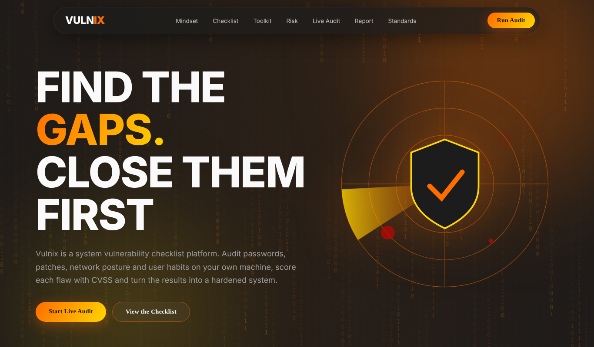
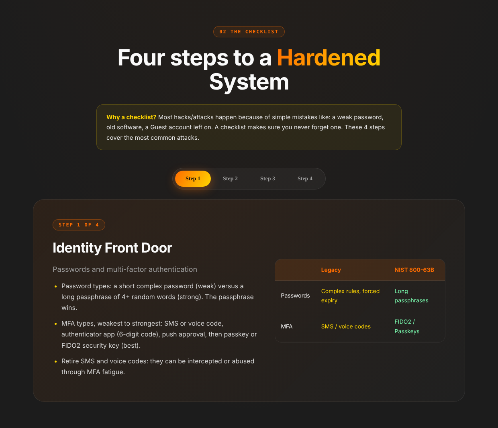
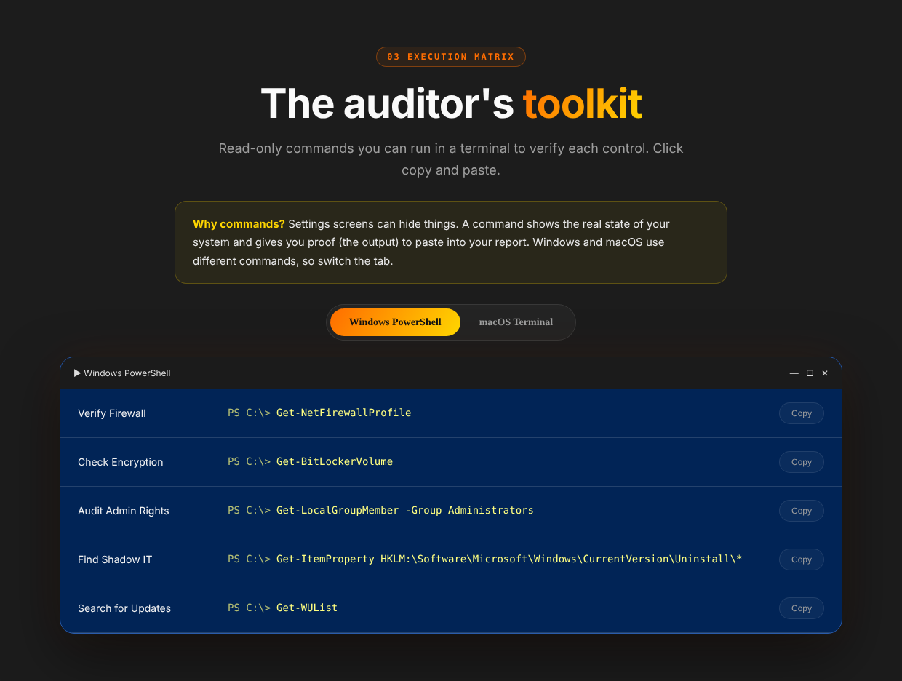
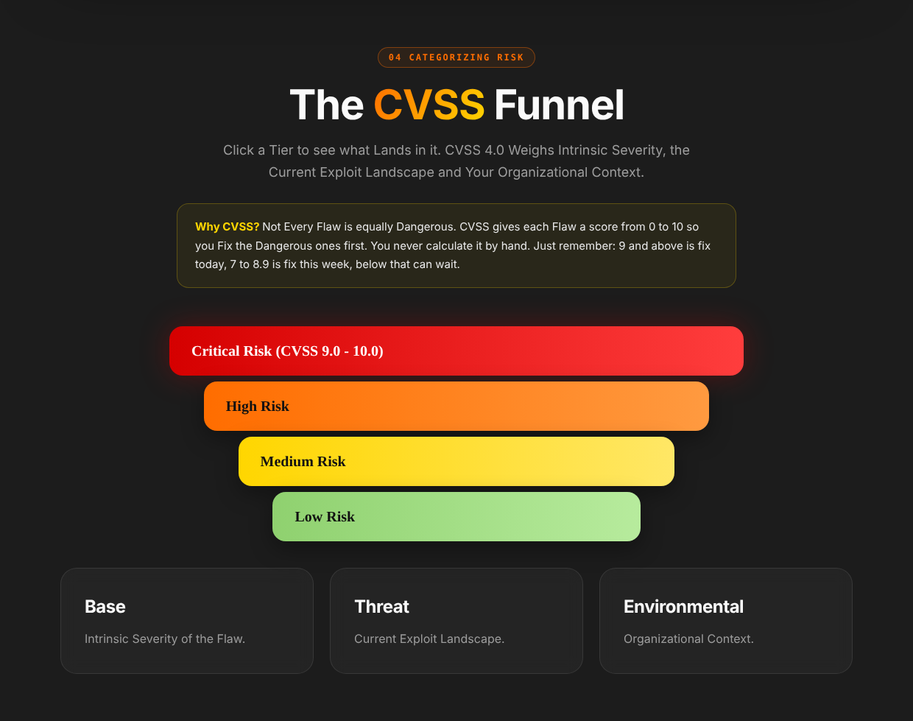
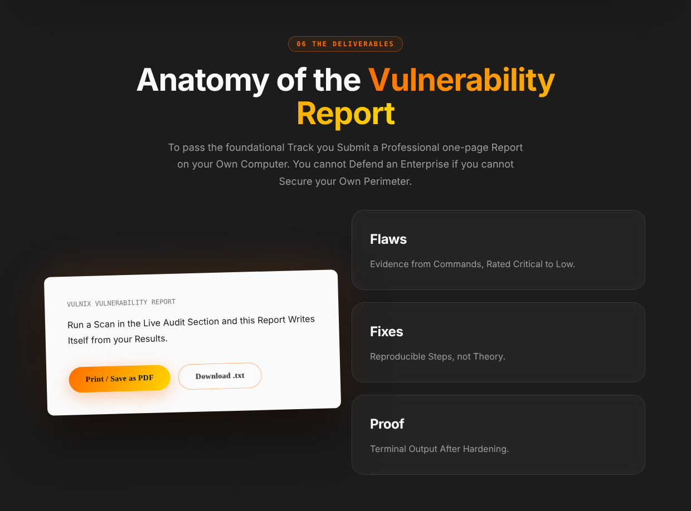

# Vulnix

**A system vulnerability checklist and live audit tool**
Cyber Security Internship, Project 4 (System Vulnerability Checklist), DecodeLabs, Batch 2026.

  

Vulnix turns the Project 4 brief into a working tool. It explains the Blue Team approach to security, then audits your own computer with read-only checks, scores each flaw with CVSS, shows how to fix it, and writes the one-page vulnerability report for you.



## Table of contents

1. [Features](#features)
2. [Screenshots](#screenshots)
3. [What gets checked](#what-gets-checked)
4. [Tech stack](#tech-stack)
5. [Project structure](#project-structure)
6. [How to run](#how-to-run)
7. [How to use it for the Project 4 report](#how-to-use-it-for-the-project-4-report)
8. [Safety](#safety)
9. [Known limitations](#known-limitations)
10. [Standards referenced](#standards-referenced)

## Features

- **Live audit:** a Python backend runs read-only system checks and the page shows every result with a severity and a CVSS score.
- **Highlighted findings:** each vulnerability is marked red, orange or yellow, with a plain-language fix and a copyable command.
- **Hardening score:** an animated ring that updates after every scan, so you can show the before and after.
- **Auto-generated report:** the three-section report (Flaws Found, Remediation Actions, Hardened Verification) fills itself from your scan results. Export it with Print / Save as PDF or as a .txt file.
- **Execution matrix:** the auditor's commands for Windows PowerShell and macOS Terminal, each with a copy button.
- **Learning content:** the proactive defence mindset, the four checklist steps, the CVSS risk funnel, and how this maps to ISO 27001, SOC 2 and CIS Controls v8.
- **Manual checklist:** for things a script cannot see, such as MFA and screen lock timeout.

## Screenshots

| The four-step checklist | Execution matrix |
|---|---|
|  |  |

| Risk funnel | Report section |
|---|---|
|  |  |

## What gets checked

| Check | What it looks at | Severity | CVSS | Windows | macOS | Linux |
|---|---|---|---|:-:|:-:|:-:|
| Firewall | Firewall enabled | Critical | 9.1 | Yes | Yes | Yes |
| Encryption | BitLocker / FileVault / LUKS | High | 7.8 | Yes | Yes | Yes |
| Password | Password required, minimum length policy | High / Medium | 7.5 / 5.3 | Yes | Yes | Yes |
| Antivirus | Real-time protection / Gatekeeper | High | 7.4 | Yes | Yes | No |
| Updates | Automatic updates enabled | High | 7.2 | Yes | Yes | Yes |
| UAC / SIP | User Account Control / System Integrity Protection | High | 7.0 | Yes | Yes | No |
| Guest account | Guest account enabled | Medium | 6.1 | Yes | Yes | Yes |
| Remote access | Remote desktop / remote login | Medium | 5.9 | Yes | Yes | No |
| Admins | More than two accounts in the admin group | Medium | 5.5 | Yes | Yes | Yes |

MFA, screen lock timeout, USB devices and installed software are not detected by the script. Use the manual checklist and the toolkit commands for those.

## Tech stack

- **Python 3** standard library only (`http.server`, `subprocess`, `platform`). Nothing to install.
- **HTML, CSS and JavaScript** in a single file, `index.html`. No frameworks.

## Project structure

```
vulnix/
├── app.py          Python server and the audit checks
├── index.html      The website (HTML, CSS and JS in one file)
├── screenshots/    Images used in this README
└── README.md
```

## How to run

1. Install Python 3.
2. Put `app.py` and `index.html` in the same folder.
3. Open a terminal in that folder and run:
   ```bash
   python app.py
   ```
4. Open http://localhost:8000 in your browser.
5. Go to **Live Audit** and press **Run Scan**.

Do not open `index.html` by double-clicking it. The scan needs the Python server, otherwise the page shows "Backend not reachable".

### Run as Administrator (Windows)

The encryption check (BitLocker) needs administrator rights. Open PowerShell with **Run as administrator**, go to the project folder, then run `python app.py`. Without it, that check shows **Not verified** and does not count as passed. Windows Home has no BitLocker, so verify it manually in Settings > Privacy & security > Device encryption.

## How to use it for the Project 4 report

1. Run the scan **before** changing anything. This is your "before".
2. Fix at least three findings using the commands shown under each result.
3. Press **Run Scan** again without reloading the page. This is your "after" proof.
4. Open the **Report** section, then use Print / Save as PDF or Download .txt.

Reloading the page clears the report, so export it first.

## Safety

- **Scanning is read-only.** Every check only reads a setting. Nothing is changed, installed or deleted.
- The server listens on `127.0.0.1` only, so other devices cannot reach it, and nothing is sent anywhere.
- **The fix commands do change your system.** Read them before running, run them in an Administrator terminal, and save your BitLocker recovery key before turning encryption on.
- Run Vulnix only on computers you own or have permission to audit.

## Known limitations

- Results depend on the OS version and edition. A check that cannot run is shown as Not verified, never as a pass.
- Third-party antivirus products are not recognised, so the antivirus check can flag a machine that is actually protected.
- CVSS scores are fixed estimates for each type of finding, not a full CVSS calculation.
- The macOS and Linux checks are less tested than the Windows ones.

## Standards referenced

NIST SP 800-63B (passwords and authentication), CVSS 4.0, ISO/IEC 27001:2022, SOC 2 (Common Criteria) and CIS Critical Security Controls v8.

## Credits

Built as part of the Cyber Security Industrial Training Kit by DecodeLabs, 2026.
Author: S Fatima Manzoor
